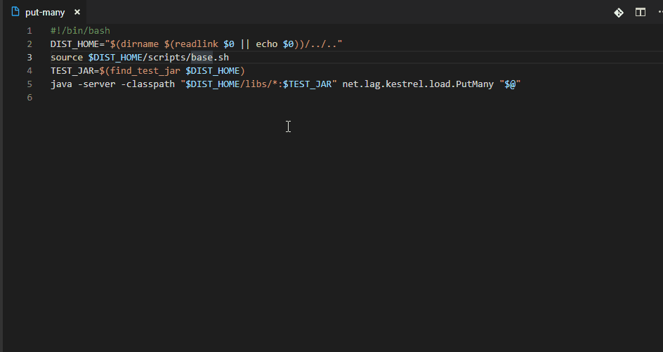
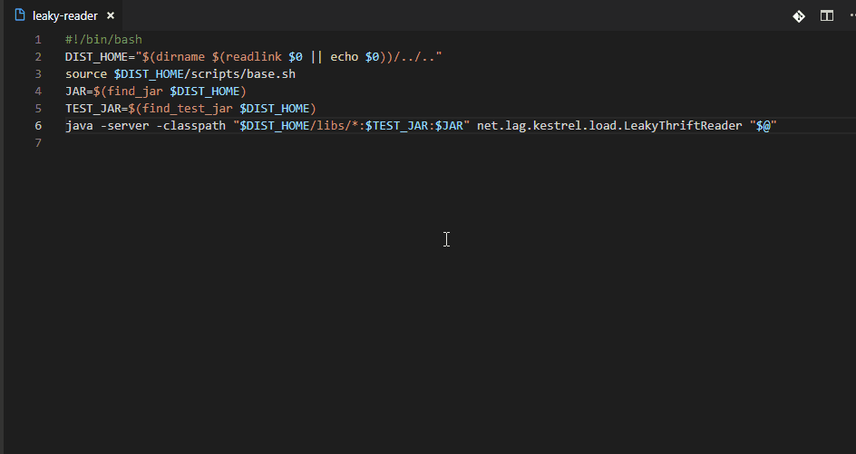
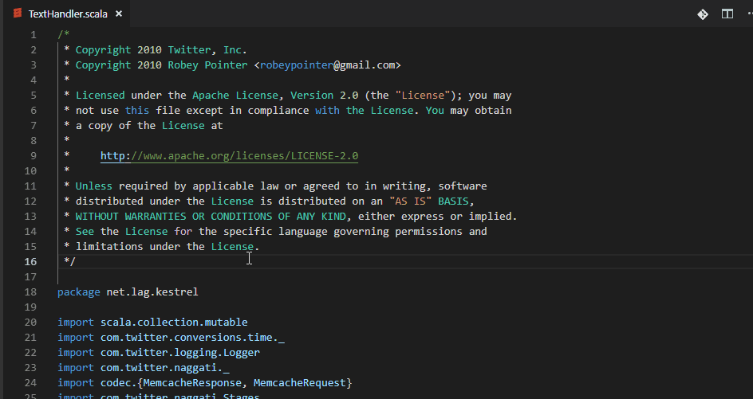

# Open File At Cursor, an extension for `vscode`

Simple [VSCode extension](https://marketplace.visualstudio.com/items?itemName=ivoh.openfileatcursor) to use a keyboard shorcut to jump to file its name is mentioned in the edited file (under the cursor). Can help to navigate source code of language wihtout installed intellisense support, filenames inside strings or multi-language projects where components are just loosely coupled via their name references. Can jump with one click to referenced files in text. e.g. shell file can reference sql file or python file or java/scala class loader parameter, etc...

## Features

This extension is inspired by [Open file From Path](https://marketplace.visualstudio.com/items?itemName=jack89ita.open-file-from-path) extension. But instead of implementing searching for the file it uses vscode's built-in functionality (command `quickOpen`).



## Shortcut
```
Open file at cursor : Alt + D
Open related file : Ctrl + Shift + Alt + D
```
* takes selected text and look file with name that name or part of the name,
* if nothing is selected then it takes current word under cursor (including dots)
* if nothing is selected and no word is under cursor it looks for files that has base name similar to the current file (e.g. tests, configurations etc...)
* Ctrl + Shift + Alt + D - opens file(s) related to the opened one (files with the same base name). Can be helpful to jump into test files or markup files, code behind files etc....

### Tips

* Open Word under cursor without the dots: `ctrl+d` then `alt+d`.



* Open tests: go to place without text then `alt+d`


## Extension Settings
 
* `openfileatcursor.filenameRegEx`: Custom matching regExp to detect the unquoted file (defaul words with dots and -). Default value:  `([\w\.\-]+)`
* `openfileatcursor.shouldDefaultToCurrentFile`: Use current file name (without file extension) if no word is at the cursor location. Otherwise show error. Default value: `true`. This can help to navigate to test files, configuration files, sql files or other type of files having the same base name or different extension than the current file.
* `openfileatcursor.shouldUseSelection`: Use text selection than the current word under cursor in case text is selected. Default value: `true`.

## Release Notes

### 0.3.0
Added open related file command (Ctrl+Shift+Alt+D)


### 0.1.0
Initial release.


-----------------------------------------------------------------------------------------------------------
